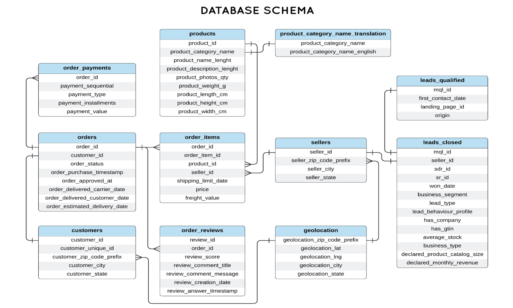

# Building a REST API for an E-commerce Application

In this project, you will build a REST API for an e-commerce application. This API will serve as the backend for managing products, customers, orders, and related data. We will use nodejs, expressjs tech stack to implement this.

You must use the below provided database schema as the foundation for your implementation.

## Database Schema

## User Stories
Create the following endpoints based on these user stories:

### Get All Products
**Description:** As a customer, I want to view all available products so I can decide what to purchase.  
**Endpoint:** `GET /products`  
**Expected Output:** A list of all products, including their ID, name, price, and stock availability.

### Register a New Customer
**Description:** As a new user, I want to register so I can make purchases.  
**Endpoint:** `POST /customers`  
**Expected Input:** Customer details like unique ID, zip code, city, and state.  
**Expected Output:** The created customer's information, including their system-generated customer ID.

### Create an Order
**Description:** As a customer, I want to place an order so I can purchase items.  
**Endpoint:** `POST /orders`  
**Expected Input:** The customer ID, a list of product items (including their ID, quantity, and price), and the order status.  
**Expected Output:** Order confirmation with the order ID, total amount, and success status.

### View Customer's Orders
**Description:** As a customer, I want to view my order history so I can track my purchases.  
**Endpoint:** `GET /customers/{customer_id}/orders`  
**Expected Output:** A list of all the customer's orders, including details like order ID, status, purchase timestamp, total amount, and items purchased.

